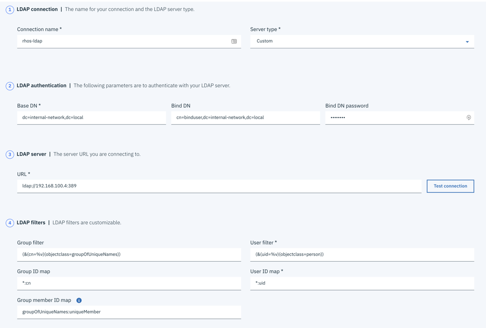

# Migration Strategy -- ICP Cluster migration

## OpenShift Installation

To migrate from ICP to Openshift, the recommended approach is a
blue-green deployment where an Openshift cluster is created alongside an
existing ICP cluster, the workload is migrated from ICP to Openshift,
load balancers or DNS entries are updated to point clients at the new
cluster, and the ICP cluster is retired.

We highly recommend infrastructure automation to create new clusters for
Openshift. This provides the quickest path for new cluster creation. We
have published infrastructure automation templates for ICP on various
cloud platforms, for example:

<https://github.com/ibm-cloud-architecture/terraform-icp-vmware>

Terraform Examples for OpenShift will be published soon.

In scenarios where resources are limited, the approach involves draining
and removing under-utilized ICP worker nodes and using the capacity to
build a small Openshift control plane with a few workers. Depending on
available capacity, an Openshift cluster can start as a single master
and scale up to three masters as capacity is made available.

## User Migration

### User Authentication migration -- LDAP

Kubernetes does not have users; it's up to the Kubernetes distribution
to provide an authentication endpoint that performs user authentication
and identity mapping to either a User or a Group. Kubernetes does have
roles and cluster roles, which are used to group permissions, and
rolebindings and clusterrolebindings, which are used to assign
permissions to particular users or groups.

For more information about how authentication is implemented in
Kubernetes, see:

<https://kubernetes.io/docs/reference/access-authn-authz/authentication/>

In ICP, the internal auth-idp component is used as an OIDC provider that
authenticates users. This component can be configured from the UI and
will connect to LDAP on behalf of the cluster to authenticate users. The
"Teams" concept is used to group together users or groups from LDAP into
logical groups and is managed by the auth-idp component and persisted in
mongodb.

Openshift 3.11 has a similar component embedded in the API server that
performs authentication on behalf of the cluster. However, it does not
have a UI to configure LDAP, so it takes some work during installation
or after installation to configure LDAP.

<https://docs.openshift.com/container-platform/3.11/install_config/configuring_authentication.html#LDAPPasswordIdentityProvider>

Openshift 4.x uses a separate operator to perform authentication, and
another operator manages that operator and its configuration using a
CustomResourceDefinition to configure LDAP and other identity providers.

<https://docs.openshift.com/container-platform/4.1/authentication/identity_providers/configuring-ldap-identity-provider.html>

In our migration scenario, we specifically we looked at migrating an
existing ICP LDAP connection to Openshift 3.11.

Our LDAP server had the following contents:

```
dn: dc=internal-network,dc=local
dc: internal-network
objectClass: top
objectClass: domain

dn: cn=ldapadm,dc=internal-network,dc=local
objectClass: organizationalRole
cn: ldapadm

dn: ou=People,dc=internal-network,dc=local
objectClass: organizationalUnit
ou: People

dn: ou=Group,dc=internal-network,dc=local
objectClass: organizationalUnit
ou: Group

dn: cn=binduser,dc=internal-network,dc=local
cn: binduser
objectClass: organizationalRole
objectClass: top
objectClass: simpleSecurityObject

dn: cn=user1,ou=People,dc=internal-network,dc=local
cn: user1
objectClass: person
objectClass: simpleSecurityObject
objectClass: uidObject
objectClass: top
sn: one
uid: user1

dn: cn=dev1,ou=Group,dc=internal-network,dc=local
cn: dev1
objectClass: groupOfUniqueNames
objectClass: top
uniqueMember: cn=user1,ou=People,dc=internal-network,dc=local
uniqueMember: cn=user2,ou=People,dc=internal-network,dc=local

dn: cn=user2,ou=People,dc=internal-network,dc=local
cn: user2
objectClass: person
objectClass: simpleSecurityObject
objectClass: uidObject
objectClass: top
sn: user two
uid: user2

dn: cn=clusteradmin,ou=People,dc=internal-network,dc=local
cn: clusteradmin
objectClass: person
objectClass: simpleSecurityObject
objectClass: uidObject
objectClass: top
sn: cluster admin
uid: clusteradmin

dn: cn=admin,ou=Group,dc=internal-network,dc=local
cn: admin
objectClass: groupOfUniqueNames
objectClass: top
uniqueMember: cn=clusteradmin,ou=People,dc=internal-network,dc=local

dn: cn=dev2,ou=Group,dc=internal-network,dc=local
cn: dev2
objectClass: groupOfUniqueNames
objectClass: top
uniqueMember: cn=user3,ou=People,dc=internal-network,dc=local
uniqueMember: cn=user4,ou=People,dc=internal-network,dc=local

dn: cn=user3,ou=People,dc=internal-network,dc=local
cn: user3
objectClass: person
objectClass: simpleSecurityObject
objectClass: uidObject
objectClass: top
sn: three
uid: user3

dn: cn=user4,ou=People,dc=internal-network,dc=local
cn: user4
objectClass: person
objectClass: simpleSecurityObject
objectClass: uidObject
objectClass: top
sn: four
uid: user4
```
The ICP configuration appeared as follows:



The matching Openshift configuration was configured under
identityProviders on each master host in
/etc/origin/master/master-config.yaml. Once this was configured we
restarted docker on each master host to restart the API server. The
configuration is as follows:

```
identityProviders:
  - name: "rhos-ldap"
    challenge: true
    login: true
    mappingMethod: claim
    provider:
      apiVersion: v1
      kind: LDAPPasswordIdentityProvider
      attributes:
        id:
        - dn
        email:
        - mail
        name:
        - cn
        preferredUsername:
        - uid
      bindDN: "cn=binduser,dc=internal-network,dc=local"
      bindPassword: "Letmein"
      insecure: true
      url: "ldap://192.168.100.4:389/dc=internal-network,dc=local?uid?sub?(objectclass=person)"
```

Pay particular interest to the url. The format of the URL is

ldap://host:port/basedn?attribute?scope?filter

We have translated this from the ICP configuration, where "attribute"
and "filter" are built from the "User filter" in the ICP configuration.
The query it uses is:

`(&(attribute=%v)(filter))`

Openshift has explicit "user" and "group" resources which the API server
manages. You can list them using the familiar "oc get users" and "oc get
groups" commands as well as create additional ones.

As Openshift is a developer platform, the default mappingMethod "claim"
allows anybody that successfully authenticates access to the platform to
login and create projects. When authentication is successful, the
platform will create a "user" resource automatically. The ICP model
denies access to any users in LDAP that are not part of a team. To match
the ICP model and deny access to anybody not explicitly added to
Openshift there are two options:

-   use the mappingMethod "lookup". However this requires additional
    overhead as the administrator must individually create users in the
    Openshift platform before they are given access to log in to
    Openshift.

    <https://docs.openshift.com/container-platform/3.11/install_config/configuring_authentication.html#LookupMappingMethod>

    In our case, we created a user for user1, created an identity for it in ldap, and then mapped them together:
    ```
    $ oc create user user1
    user.user.openshift.io/user1 created

    $ oc create identity rhos-ldap:cn=user1,ou=People,dc=internal-network,dc=local
    identity.user.openshift.io/rhos-ldap:cn=user1,ou=People,dc=internal-network,dc=local created

    $ oc create useridentitymapping rhos-ldap:cn=user1,ou=People,dc=internal-network,dc=local user1
    useridentitymapping.user.openshift.io/rhos-ldap:cn=user1,ou=People,dc=internal-network,dc=local created
    ```

-   Leave the default mappingMethod "claim" but deny access to create
    new projects in Openshift. By default the "system:authenticated"
    group (i.e. anybody in LDAP) is given the "self-provisioner"
    cluster-role, which allows project creation. Removing the role
    removes the overhead of having to create new users as they log in,
    but also prevents authenticated users from consuming resources in
    the platform without cluster administrator action. See:
    <https://docs.openshift.com/container-platform/3.11/admin_guide/managing_projects.html#disabling-self-provisioning>

    ```
    $ oc patch clusterrolebinding.rbac self-provisioners -p '{ "metadata": { "annotations": { "rbac.authorization.kubernetes.io/autoupdate": "false" } } }'
    $ oc patch clusterrolebinding.rbac self-provisioners -p '{"subjects": null}'
    ```

-   We think this matches ICP the closest, but allowing users to create
    projects on their own has some advantages in developer scenarios.
    Using the above policy makes sense in production clusters but can be
    relaxed in development/test clusters.

Note that the Openshift api server does not query groups from LDAP;
group definitions must be synced manually. The documentation around this
is here:
<https://docs.openshift.com/container-platform/3.11/install_config/syncing_groups_with_ldap.html>

In our scenario we had users in the tree under ou=People, and groups
under ou=Group. Three groups were created (dev1, dev2, and admins). We
used the following rfc2307 LDAP sync config:

```
kind: LDAPSyncConfig
apiVersion: v1
url: ldap://192.168.100.4:389/dc=internal-network,dc=local
bindDN: "cn=binduser,dc=internal-network,dc=local"
bindPassword: "Letmein"
insecure: true
rfc2307:
    groupsQuery:
        baseDN: "ou=Group,dc=internal-network,dc=local"
        scope: sub
        derefAliases: never
        pageSize: 0
        filter: "(objectclass=groupOfUniqueNames)"
    groupUIDAttribute: dn
    groupNameAttributes: [ cn ]
    groupMembershipAttributes: [ uniqueMember ]
    usersQuery:
        baseDN: "ou=People,dc=internal-network,dc=local"
        scope: sub
        derefAliases: never
        pageSize: 0
    userUIDAttribute: dn
    userNameAttributes: [ uid ]
    tolerateMemberNotFoundErrors: false
    tolerateMemberOutOfScopeErrors: false
```

Observe how this maps to the configuration in ICP; the groups are of
object class "groupOfUniqueNames" and the "uniqueMember" attribute
contains the members of the group which will be in turn queried.

Running this command will add some Openshift "Group" resources that can
be assigned roles.

```bash
$ oc adm groups sync --sync-config=rfc2307_config.yaml  --confirm
group/dev1
group/admin
group/dev2
```


The result is three groups, with the user mappings as shown.

```
$ oc get groups
NAME      USERS
admin     clusteradmin
dev1      user1, user2
dev2      user3, user4
```

As this is a manual process that produces static user/group mappings, it
may be required to run this on a schedule that updates and prunes groups
in an ongoing basis.

One additional implementation note is that Openshift issues Opaque
tokens; since the authentication module is embedded in the API server it
is able to validate the tokens internally. In ICP, the authentication
token issued by the auth service is a signed JWT that contains an
embedded list of groups that Kubernetes uses to validate permissions. In
the next session when we discuss RBAC, we can see how rolebindings and
clusterrolebindings are bound to these groups.

### User Authorization Migration (RBAC)

Kubernetes ships with some out of box user-facing cluster roles:
<https://kubernetes.io/docs/reference/access-authn-authz/rbac/#user-facing-roles>

-   cluster-admin
-   admin
-   edit
-   view

ICP ships with five additional user-facing cluster roles which
correspond to the roles used in teams:

-   icp:admin
-   icp:edit
-   icp:operate
-   icp:teamadmin
-   icp:view

These are implemented as aggregated roles, which means there are several
roles where their permissions are union-ed together to provide a full
set of permissions for the user. The permissions are contained in
aggregate roles. Note that the admin role contains all of the
permissions that the edit role contains, etc.

-   icp-admin-aggregate
-   icp-edit-aggregate
-   icp-operate-aggregate
-   icp-view-aggregate

Openshift ships with four user-facing cluster roles:

-   admin
-   basic-user
-   edit
-   view

Since RBAC is common in both Openshift and ICP, it's tempting to just
export these 9 roles to Openshift. However, some Openshift-specific
resources are added to the Kubernetes out-of-box roles. These are in the
"\*.openshift.io" apiGroups defined in the roles for the above.

As clusterroles are whitelists of permissions, and access in Kubernetes
is a union of all of the roles bound to the identity, one potential way
of quickly migrating permissions is to import the cluster roles from
ICP, assign the ICP roles to the users and groups, then assign the
Openshift "view" role to all users so that the projects will appear in
the CLI and UI. The Openshift "view" role will overlap with the
"icp:view" role but the Openshift "view" role will enable view of the
Openshift specific resources (e.g. projects, builds, etc). This will
allow the same access to the Kubernetes API that was assigned in ICP.
Additional access to Openshift specific objects (e.g. to create a build,
deployment configs, etc) may be added by assigning Openshift specific
roles like "edit", "admin", etc.

Here is one team that we created with the following group/user mappings:

```
$ cloudctl iam team-get dev-1
Name: dev1
ID: dev-1

ID      Type    Name    Email   Roles   
dev1    group   -       -       Viewer   
user1   user    user1   -       Administrator   
```

With the following resources assigned:

```
$ cloudctl iam resources -t dev-1
CRN   
crn:v1:icp:private:k8:jkwong-icp-31-cluster:n/dev1:::   
```

We exported the 9 ICP roles from ICP as yamls, and imported them into
openshift.

```
$ kubectl get clusterroles | grep icp | awk '{print $1}' | xargs -n1 -I{} kubectl get clusterrole {} -o yaml  | tee  all-roles.yaml

...

$ oc apply -f all-roles.yaml
```

Then we created the associated resources (i.e. the namespace/project)
and mapped the same permissions using the following commands:

```
$ oc new-project dev1
Now using project "dev1" on server "https://console.jkwong-ocp.internal-network.local:443".

You can add applications to this project with the 'new-app' command. For example, try:

    oc new-app centos/ruby-25-centos7~https://github.com/sclorg/ruby-ex.git

to build a new example application in Ruby.

$ oc adm policy add-role-to-group view dev1
role "view" added: "dev1"
$ oc adm policy add-role-to-group icp:view dev1
role "icp:view" added: "dev1"
$ oc adm policy add-role-to-user view user1
role "view" added: "user1"
$ oc adm policy add-role-to-user icp:admin user1
role "icp:admin" added: "user1"
```

## Workload Migration

In this section we focused on migrating our cloud native reference
application BlueCompute that was running on ICP to Openshift.

<https://github.com/ibm-cloud-architecture/refarch-cloudnative-kubernetes>

#### DevOps and Developer toolchains

#### Declarative deployment and GitOps adoption

#### Using a Backup/Restore approach using Velero

#### Modify containers to run as non-root and other mitigations

Following some guidelines here:

<https://docs.openshift.com/container-platform/3.11/creating_images/guidelines.html>

Openshift specific:

<https://docs.openshift.com/container-platform/3.11/creating_images/guidelines.html#openshift-specific-guidelines>

In general, when authoring containers, developers should treat the
container filesystem as read only.

If a container's Dockerfile does not set a USER, then it runs as root.
This is dangerous because root inside a container is still root on the
host. Openshift prevents containers from running as "root" by applying a
default "restricted" SecurityContextConstraint. When a container is
started, Openshift will randomly select a uid from a range that does not
have access to anything on the worker node in case a malicious container
process is able to break out of its sandbox.

In most application scenarios, the actual user a process runs as doesn't
matter, but there are some legitimate cases where the container expects
to be run as a particular user, such as some database containers or
other applications where it needs to read or write to its local
filesystem or to a persistent volume. A simple mitigation is to add the
USER directive to the Dockerfile before the CMD or ENTRYPOINT so that
the main container process does not run as root, e.g.

`USER 1000`

It's better to provide a numeric value rather than an existing user in
/etc/passwd in the container's filesystem, as Openshift will be able to
validate the numeric value against any SCCs that restrict the uids that
a container may run as. In the case where we use a third party container
and we are not able to modify the Dockerfile, or the USER directive
refers to a user that corresponds to something in /etc/passwd, we can
add the securityContext section to the podspec to identify the UID that
it the pod refers to. For example, in BlueCompute the MySQL container we
used is from dockerhub, but they allow running as USER mysql which
corresponds to uid 5984 in /etc/passwd, so we added this section to the
podSpec in the deployment:

```
securityContext:
  runAsUser: 5984
  runAsGroup: 5984
  fsGroup: 1000
```

The fsGroup is useful to provide supplemental groups which are added to
the container's processes. For example, in the above case the container
process can also interact with files owned by group 1000, which might be
helpful if using existing shared storage where there are directories
owned by the group.

If filesystem access is needed in the container filesystem, then those
files should be owned by and read/writable by the root group. In
Openshift, the arbitrary uid used by the \"restricted\" SCC will be
added to the \"root\" group. Directories that must be read to/written
from as scratch space may add the following to the Dockerfile:

```
RUN chgrp -R 0 /some/directory && \
    chmod -R g=u /some/directory
```

Another strategy that we've had success with is to create an emptyDir
volume and mount it to the directory, which Kubernetes will create and
destroy with the pod. The emptyDir volume is owned by root but is world
writable and can be used as local storage for the container. This also
helps someone reviewing the pod definition identify which directories
will be written to.

```
volumes:
- emptyDir: {}
  name: database-storage
```

In cases where existing shared storage is attached to the container as a
volume, and the container must write to the filesystem as a particular
uid, we can run the pod under a service account, and assign the
\"nonroot\" scc to the service account. This relaxes the restrictions on
the uid and allows the container process to be executed as some specific
UID, but not root. This is essentially equivalent to ICP's
"ibm-restricted-psp\" security policy. For example, in our above example
our MySQL container runs as uid 5984, but Openshift blocks the execution
since the uid is not within the allowed range for "restricted" SCC, so
we created a service account "inventory-mysql" for the pod, allow it to
use the "nonroot" SCC and set the deployment to run as this service
account.

```
$ oc create serviceaccount inventory-mysql
$ oc adm policy add-scc-to-user nonroot -z inventory-mysql
$ oc patch deploy/inventory-mysql --patch \
     '{"spec":{"template":{"spec":{"serviceAccountName":"inventory-myql"}}}}}'
```

In cases where running as the root user is absolutely necessary, we can
leverage a serviceaccount and assign the \"anyuid\" SCC to allow the
container to run as root. For example, in our BlueCompute reference
application, couchdb only works when it runs as root due to the way it
tries to change ownership of the data directories. We will allow couchdb
to run as root user:

Steps in ICP:
```
$ kubectl ceate serviceaccount -n bluecompute customer-couchdb
$ kubectl create role psp-ibm-anyuid-psp -n bluecompute --verb=use \
     --resource=podsecuritypolicy --resource-name=ibm-anyuid-psp
$ kubectl create rolebinding couchdb-ibm-anyuid-psp -n bluecompute \
     --role=psp-ibm-anyuid-psp --serviceaccount=bluecompute:customer-couchdb
```
Now we add the serviceaccount to the podspec in the statefulset.

```
$ kubectl patch deploy/couchdb --patch \
     '{"spec":{"template":{"spec":{"serviceAccountName":"customer-couchdb"}}}}}'
```

Similarly, in Openshift:
```
$ oc create serviceaccount -n bluecompute customer-couchdb
$ oc adm policy add-scc-to-user anyuid -z customer-couchdb
$ oc patch deploy/couchdb --patch \
     '{"spec":{"template":{"spec":{"serviceAccountName":"customer-couchdb"}}}}}'
```

### Converting PodSecurityPolicy to SecurityContextConstraints

### Helm Charts

### Application LoadBalancer cutover

## Storage Migration

We will focus on Kuberentes Storage under the context of ICP to OCP migration. For detail storage and Kuberentes usage, please reference the [Kubernetes Storage Cookbook](https://ibm-cloud-architecture.github.io/kubernetes-storage-cookbook/).

The migration has to take into consideration of both the Kuberentes Storage Provider and Storage consumer (database or application).

### Storage Provider

In general, Kuberentes supports quite a few storage providers including hostPath, NFS, Ceph, Gluster, vSphere, minio, Cloud-based storage (S3 etc.). And these providers can be deployed either as a part of a Kuberentes cluster (internal storage) or storage provided by an external service (external storage). For the migration, we'll focus on the internal storage or in-cluster storage provider.

Following storage can be hosted on ICP cluster nodes:

- GlusterFS
- Ceph block storage by using Rook
- Minio

Red Hat OpenShift support both GluserFS and Ceph as in-cluster storage providers. Haven't heard the official support for Minio.

There is no migration path or tools available to migrate ICP storage nodes to OpenShift. So, it boils down to handle the migration from the storage consumer's aspect.

If you are using external storage provider, as far as it is supported by OpenShift (all do except Minio), you just need to migrate the storage consumer and leave the external storage provider as-is.

If you are using internal storage provider, you need to setup the OpenShift Storage nodes, either GlusterFS or Ceph, using the same/similar spec as in ICP in terms of disk size, storage type, number of nodes. Then, proceed to storage consumer migration.

### Storage Consumer

Each client might have different storage consumption pattern, we'll try to categorize them into the following:

- Container applications requires persistent Storage
- Kubernetes Statefulset application
- Databases running on Kubernetes such as MongoDB, MySQL, Cloudant etc.

We'll assume that all these storage needs are implemented as Kuberentes recommended Persistent Volume (PV) and Persistent Volume Claims (PVC).

When it comes to migration to OCP, it really becomes a storage backup and restore discussion. Depends on the storage consumer type (database vs. custom application), it can be done with:

- Kubernetes PV backup and restore
- Using Application/Database native backup-restore tools

This guide will be focus on the first approach where you migrate kubernetes PV.

One common approach of backing up Kubernetes PV is the [Velero project](https://github.com/heptio/velero) from Heptio. The concept is Velero will take your PV snapshots, stores it on object storage (like S3 or Minio). Then, you can restore it to another Kubernetes cluster.

For detail on how the tool works in generic Kubernetes, please reference [this blog post](https://blog.kubernauts.io/backup-and-restore-of-kubernetes-applications-using-heptios-velero-with-restic-and-rook-ceph-as-2e8df15b1487)

Still, there are some limitations with Velero approach. For example:

- It does not support the migration of persistent volumes across cloud providers.
- Velero + Restic currently supports backing up to only S3 compatible object storage.   


## Platform Data Migration

### Monitoring Data

### Historical Log Data
